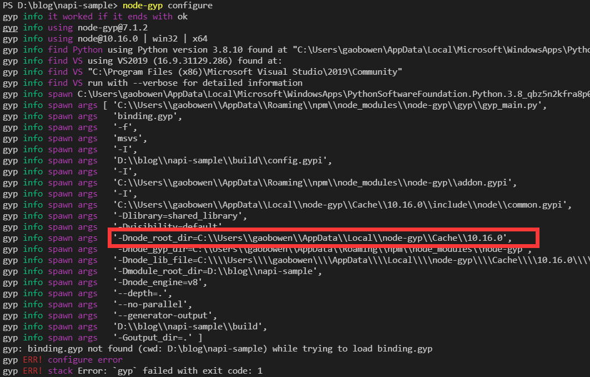
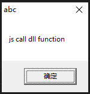

# Nodejs C++插件（N-API）

- [0. 环境搭建](#abcd-0)
- [1. JS中调用C++方法](#abcd-1)
  - [1.1 JS中调用源文件的C++方法](#abcd-1-1)
  - [1.2 JS中调用动态库的C++方法](#abcd-1-2)
- [2. C++中调用JS方法](#abcd-2)
  - [2.1. C++单线程调用JS方法](#abcd-2-1)
  - [2.2. C++多线程调用JS方法](#abcd-2-2)

> N-API 作为Nodejs项目的一部分，旨在更加便捷稳定的创建Nodejs Native 插件。这个API作为应用二进制接口(ABI)，在Node.js的各个版本中都是稳定的，而且ABI允许一个在主要版本编译的模块，在以后的Node.js版本上运行，而无需重新编译。

<span id='abcd-0'></span>

## 0. 环境搭建
1. 安装最新的npm，且Nodejs版本10.x以上
2. 工具链
    - Windows执行 ```npm install --global windows-build-tools``` 
    - MacOS执行 ```xcode-select --install```
    - Linux使用系统自带的GCC即可
3. 安装构建工具 ```npm install --global node-gyp```
4. 初始化测试项目 ```npm init```
5. 添加napi模块```npm i node-addon-api```
6. 为VSCode添加智能提示所需头文件（以Windows为例）  
    - ```Ctrl+Shift+P``` -> C++ 添加 ```c_cpp_properties.json``` 文件
    - 执行 ```node-gyp configure``` 查看 ```-Dnode_root_dir``` 选项打印，确认node头文件目录
    
    - ```c_cpp_properties.json``` includePath 中加入 ```C:\\Users\\gaobowen\\AppData\\Local\\node-gyp\\Cache\\10.16.0\\include\\node``` 

<span id='abcd-1'></span>  

## 1. JS中调用C++方法

<span id='abcd-1-1'></span>

### 1.1 JS中调用源文件的C++方法
1. 编写功能函数
test.h、test.cc
```cpp
#ifndef SAMPLE_TEST_H
#define SAMPLE_TEST_H
#include <napi.h>
#include <Windows.h>
#include <sstream>
#include <thread>

Napi::Value plus(const Napi::CallbackInfo& info);

#endif
```

```cpp
#include "test.h"

Napi::Value plus(const Napi::CallbackInfo& info) {
    Napi::Env env = info.Env();
    Napi::EscapableHandleScope scope(env);
    if (info.Length() < 1)
        return Napi::Boolean::New(env, false);
    if (!info[0].IsNumber())
        return Napi::Boolean::New(env, false);
    if (!info[1].IsNumber())
        return Napi::Boolean::New(env, false);
    auto a = info[0].As<Napi::Number>().DoubleValue();
    auto b = info[1].As<Napi::Number>().DoubleValue();

    return Napi::Number::New(env, a + b);
}

```
2. 编写导出函数
exports.cc
```cpp
#include <napi.h>
#include "test.h"

Napi::Object Init(Napi::Env env, Napi::Object exports)
{
    exports.Set(Napi::String::New(env, "plus"), Napi::Function::New(env, plus));    
    return exports;
}

NODE_API_MODULE(napi_sample, Init)
```
3. 添加 ```binding.gyp``` 文件
```gyp
{
  "targets": [
    {
      "target_name": "napi_sample",
      "sources": [ ],
      "cflags!": [ "-fno-exceptions" ],
      "cflags_cc!": [ "-fno-exceptions" ],
      "defines": [ "NAPI_DISABLE_CPP_EXCEPTIONS" ],
      "include_dirs": [
        "<!@(node -p \"require('node-addon-api').include\")"
      ],
      "conditions": [
        ['OS=="win"', {
          "sources": [ "sample/exports.cc", "sample/test.cc" ],
        }]
      ]
    }
  ]
}
```
4. 命令行执行 ```node-gyp rebuild``` 生成 ```./build/Release/napi_sample.node```文件
5. 测试使用```napi_sample.node```插件  
``` node .\test.js```
```js
let { plus } = require('./build/Release/napi_sample.node');

console.log('test export=>', plus);
console.log('test call=>', plus(1.2, 1.3));
```
控制台输出
```
test export=> function () { [native code] }
test call=> 2.5
```

<span id='abcd-1-2'></span>

### 1.2 JS中调用动态库的C++方法
```cpp
Napi::Value call_dll(const Napi::CallbackInfo& info) {
    Napi::Env env = info.Env();
    Napi::EscapableHandleScope scope(env);
    //注，若动态库还有其他依赖库，请放在同一级目录下
    auto m = LoadLibraryExA("user32.dll", NULL, LOAD_WITH_ALTERED_SEARCH_PATH);
    typedef int(*MyMessageBoxA)(int, char*, char*, int);
    auto box = (MyMessageBoxA)GetProcAddress(m, "MessageBoxA");
    box(0, "js call dll function", "abc", 0);
    
    return Napi::Boolean::New(env, true);
}
```
控制台输出
```
test call_dll=> true
```


<span id='abcd-2'></span>

## 2. C++中调用JS方法

<span id='abcd-2-1'></span>

### 2.1. C++单线程调用JS方法
test.cpp
```cpp
Napi::Value cpp_call_js(const Napi::CallbackInfo& info) {
    Napi::Env env = info.Env();
    Napi::EscapableHandleScope scope(env);
    if (info.Length() < 0)
        return Napi::Boolean::New(env, false);
    if (!info[0].IsFunction())
        return Napi::Boolean::New(env, false);
    auto jscb = info[0].As<Napi::Function>();

    //回调函数入参
    napi_value a, b;
    napi_create_double(env, 1, &a);
    napi_create_double(env, 2, &b);

    napi_value argv[] = { a, b };

    //回调函数返回值
    napi_value result;
    napi_call_function(env, env.Global(), jscb, 2, argv, &result);

    return Napi::Value(env, result);
}
```
test.js
```js
let { cpp_call_js } = require('./build/Release/napi_sample.node');
(async function () {

    let c = 3;
    let js_callback = function(a, b){
        return a + b + c;
    }
    console.log('test cpp_call_js=>', cpp_call_js(js_callback));

})();
```
控制台输出
```
test cpp_call_js=> 6
```

<span id='abcd-2-2'></span>

### 2.2. C++多线程调用JS方法
test.cpp
```cpp
Napi::ThreadSafeFunction tsfunc;
void thread_function() {
    auto threadid = std::this_thread::get_id();
    std::stringstream ss;
    ss << threadid;
    auto threadidstr = new std::string(ss.str());

    auto callback = [threadid](Napi::Env env, Napi::Function jscb, std::string* p_str) {
        jscb.Call({ Napi::String::New(env, *p_str) });
        delete p_str;
    };

    tsfunc.Acquire();
    napi_status status = tsfunc.BlockingCall(threadidstr, callback);
    if (status != napi_ok) {
        printf("tsfunc.BlockingCall error.\n");
    }
    tsfunc.Release();

}

Napi::Value cpp_thread_call_js(const Napi::CallbackInfo& info) {
    Napi::Env env = info.Env();
    Napi::EscapableHandleScope scope(env);
    if (info.Length() < 0)
        return Napi::Boolean::New(env, false);
    if (!info[0].IsFunction())
        return Napi::Boolean::New(env, false);
    auto jscb = info[0].As<Napi::Function>();
    tsfunc = Napi::ThreadSafeFunction::New(env, jscb, "my-tsfunc", 2, 2);
    std::thread(thread_function).join();
    std::thread(thread_function).join();
    return Napi::Boolean::New(env, true);
}
```

test.js
```js
let { cpp_thread_call_js } = require('./build/Release/napi_sample.node');
(async function () {

    let js_callback_async = function(id){
        console.log('thread_id',id);
    }
    console.log('test cpp_thread_call_js=>', cpp_thread_call_js(js_callback_async));

})();
```
控制台输出
```
test cpp_thread_call_js=> true
thread_id 6768
thread_id 12352
```
